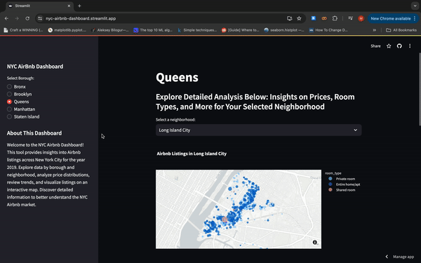

# Portfolio

## About Me
I am a graduate student at the Zicklin School of Business, finalizing my Master's of Science with a concentration in Data Analytics. I expect to graduate in December 2024. Through my studies, I have developed a strong foundation in data analysis, statistical modeling, and machine learning. My portfolio showcases a range of projects that highlight my skills in data exploration, visualization, and predictive modeling. I am eager to apply my knowledge and skills to real-world challenges and contribute to data-driven decision-making in a professional setting.

Connect with me on [LinkedIn](https://www.linkedin.com/in/matthew-paz/) or send me an [email](mailto:paz.matthew@me.com).

## Projects
## Marketing Binary Classification Project

This project focuses on building and evaluating binary classification models to predict whether a consumer will respond to an offer from a sales campaign, with a binary target variable representing acceptance (1) or not-accepted (0). The analysis involves Exploratory Data Analysis (EDA), feature engineering, model selection, and performance evaluation.

### R Packages Used
- dplyr
- ggplot2
- caret
- pROC
- e1071
- RColorBrewer
- ROSE
- ggcorrplot

### Conclusion
Maximizing precision ensures that the model accurately identifies true positives (responders) while minimizing false positives (non-responders). This is crucial in marketing, where targeting the right customers impacts campaign success and cost-effectiveness.

In this project, I evaluated several models for classifying customer responses to marketing campaigns. The Support Vector Machine (SVM) model achieved the highest precision score of 0.85, correctly identifying likely responders 85% of the time.

This high precision makes the SVM model highly effective for this classification task. By using the SVM model, marketers can better target potential customers, leading to more successful and efficient campaigns.

### Summary
- **Importance of Precision**: High precision minimizes false positives, crucial for effective marketing.
- **Model Performance**: The SVM model achieved the highest precision score of 0.85 among the evaluated models.
- **Implications**: Implementing the SVM model can enhance the accuracy of marketing campaigns, improving their efficiency and effectiveness.

[Binary Classification Project](Projects/BinaryClassificationProject.html)

## NYC Airbnb Dashboard

This dashboard showcases my ability to handle real-world data, perform comprehensive Exploratory Data Analysis (EDA), and create interactive visualizations that can help in making informed business decisions. It demonstrates proficiency in data analysis, visualization, and web application development.

### Technologies Used:
- **Python:** Core language for data processing.
- **Streamlit:** Framework for creating the interactive web application.
- **Plotly:** Library for creating dynamic visualizations.

### Dashboard Functionality

[NYC Airbnb Dashboard](https://nyc-airbnb-dashboard.streamlit.app/)

## Articles:
Here are some of my articles published on Medium:

* [Data Cleaning with Python](https://medium.com/@matthew.paz/data-cleaning-with-python-dealing-with-the-inevitability-of-missing-data-9cc9ab172e14)
* [Introduction to SQLite3](https://medium.com/@matthew.paz/introduction-to-sql-with-sqlite-f8a4f4f6c161)
* [Time Series Analysis Tutorial](https://medium.com/@matthew.paz/time-series-analysis-with-python-a-tutorial-for-beginners-898a3300ce9a)
